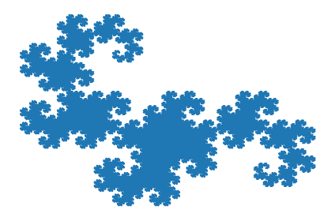
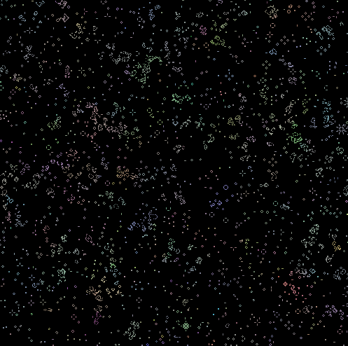
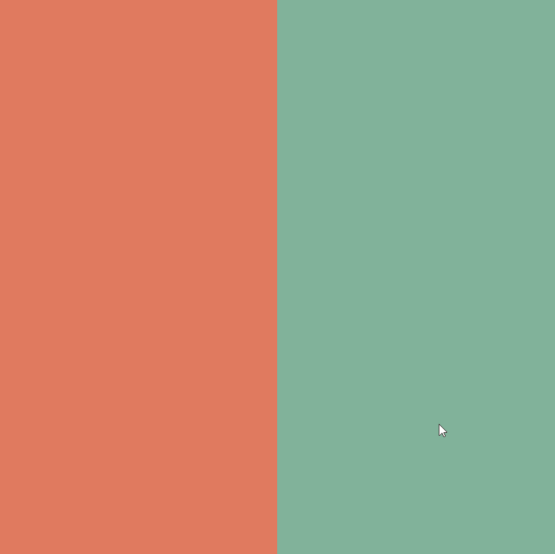

# tiny-math
A place for tiny math projects!

* dragon_curve.py makes dragon curves with numpy

* game_of_life_averages.py is the game of life, but new cells are the average color of their parents

* modular_multiplication_on_circle illustrates some nice patterns from connecting points on a circle

* numpy_mandelbrot.py produces an image of the mandelbrot set with numpy

* pendulums.py demonstrates pendulum "waves" that appear when pendulums have different lengths

* aztec_gold.py is a visualization of the arctic circle theorem

